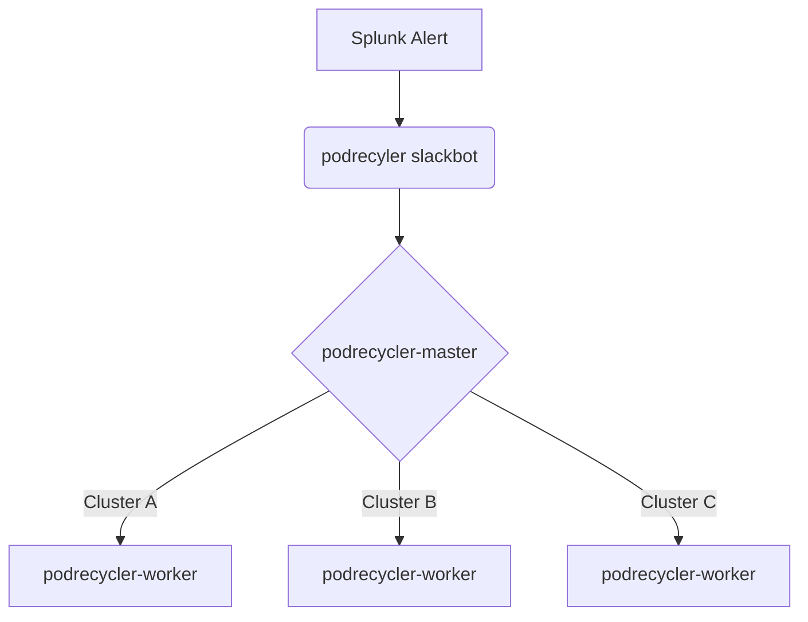

# Introduction 
The podrecycler is a python based slackbot system that listens for slack events where it is mentioned and takes the cluster, pod, and namespace from splunk alert attachments. 

It is setup in such a way so that there is a master on the primary service cluster and then workers on the child clusters that actually perform the recyclying of replicaset based pod. 

In this way the workers only have access to their own cluster and the master podrecycler has no access to any clusters directly.

# Overview of functionality.

